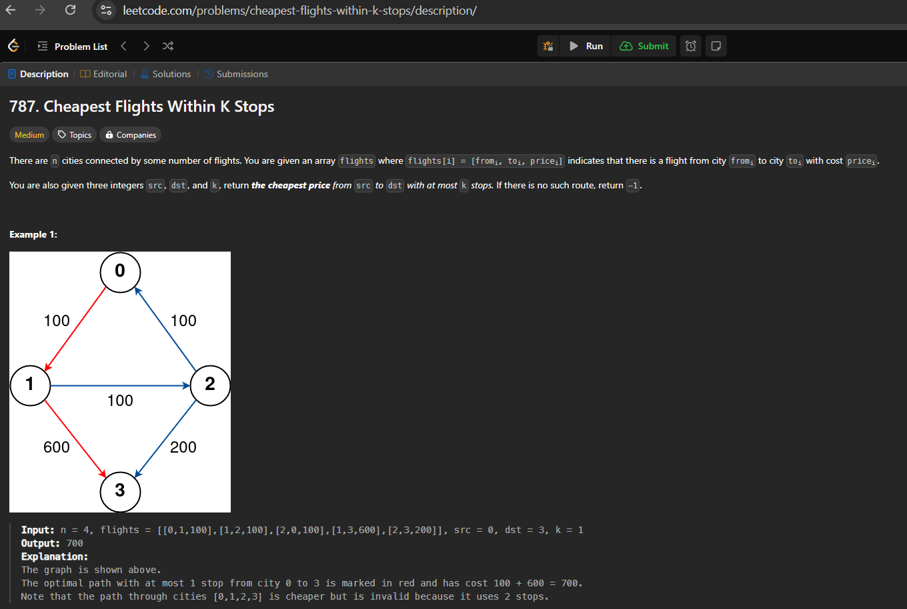

# Leetcode 787: Cheapest Flights Within K Stops

## Problem Description

There are `n` cities connected by some number of flights. You are given an array `flights` where `flights[i] = [from_i, to_i, price_i]` indicates that there is a flight from city `from_i` to city `to_i` with cost `price_i`.

You are also given three integers `src`, `dst`, and `k`. Return the cheapest price from `src` to `dst` with at most `k` stops. If there is no such route, return `-1`.

## Solution
 ``
 from typing import List
def findCheapestPrice(n: int, flights: List[List[int]], src: int, dst: int, k: int):
        prices=[float('inf')]*n
        prices[src]=0
        for i in range(k+1):
            tmpPrice=prices.copy()
            for s,d,p in flights:
                if prices[s] == float("inf"):
                    continue
                if prices[s]+p < tmpPrice[d]:
                    tmpPrice[d]=prices[s]+p
            prices=tmpPrice
        if prices[dst]==float("inf"):
            return -1
        else:
            return prices[dst]
solution=findCheapestPrice( n = 4, flights = [[0,1,100],[1,2,100],[2,0,100],[1,3,600],[2,3,200]], src = 0, dst = 3, k = 1)
print (solution)
``
## Explaination 

** Initialization: ** Create a list prices to store the minimum cost to reach each city, initialized to infinity. Set the cost to reach the source city src to 0.

** Relaxation Process:** Iterate k + 1 times, where k is the maximum number of stops allowed. For each iteration, create a temporary list tmpPrice to hold the updated costs.
** Update Costs:** For each flight [s, d, p], update the cost to reach city d from city s if a cheaper route is found.
**Result:** After the iterations, check the cost to reach the destination city dst. If it remains infinity, return -1, indicating no valid route was found within k stops. Otherwise, return the calculated cost.