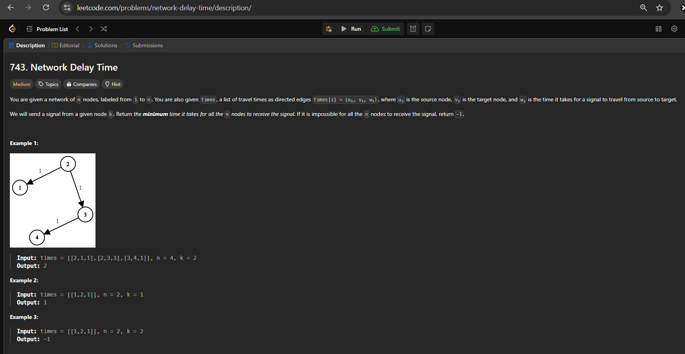

# Network Delay Problem Dijkstra

## Problem Description

You are given a network of `n` nodes, labeled from `1` to `n`. You are also given `times`, a list of travel times as directed edges `times[i] = (u_i, v_i, w_i)`, where `u_i` is the source node, `v_i` is the target node, and `w_i` is the time it takes for a signal to travel from source to target.

We will send a signal from a given node `k`. Return the minimum time it takes for all the `n` nodes to receive the signal. If it is impossible for all the `n` nodes to receive the signal, return `-1`.

## Solution

``
  import heapq
  from typing import List
  import collections
  def networkDelayTime(times: List[List[int]], n:   int, k: int):
      edges = collections.defaultdict(list)
      for u, v, w in times:
          edges[u].append((v, w))
      minHeap = [(0, k)]
      visit = set()
      t = 0
      while minHeap:
          w1, n1 = heapq.heappop(minHeap)
          
          if n1 in visit:
              continue
          
          visit.add(n1)
          t = max(t, w1)
          
          for n2, w2 in edges[n1]:
              if n2 not in visit:
                  heapq.heappush(minHeap, (w1 + w2,   n2))
      
      return t if len(visit) == n else -1
  solution=networkDelayTime([[2,1,1],[2,3,1],[3,4,1],  [3,2,1],[1,5,2]], 5,3)
  print (solution)
  
``
## Explaination

**Graph Representation:** Use a dictionary to represent the graph, where each key is a node and the value is a list of tuples representing the neighboring nodes and the travel time to them.

**Priority Queue:** Use a min-heap to always expand the node with the smallest accumulated travel time first.

**Tracking Visited Nodes:** Use a set to keep track of visited nodes to avoid processing a node more than once.

**Updating Time:** Update the maximum time t taken to reach any node.

**Result:** If all nodes are visited, return the maximum time; otherwise, return -1 indicating that not all nodes can be reached.