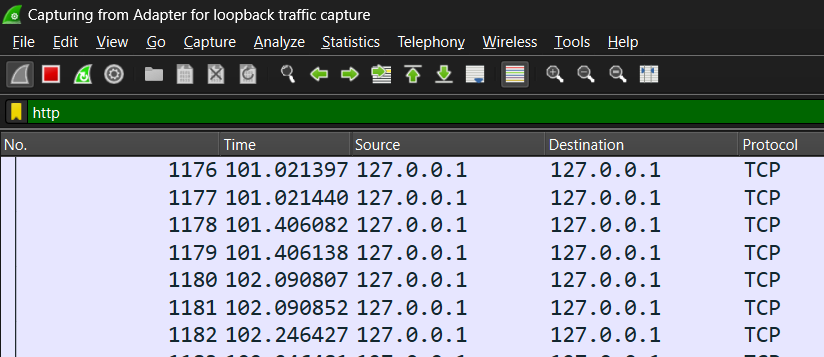
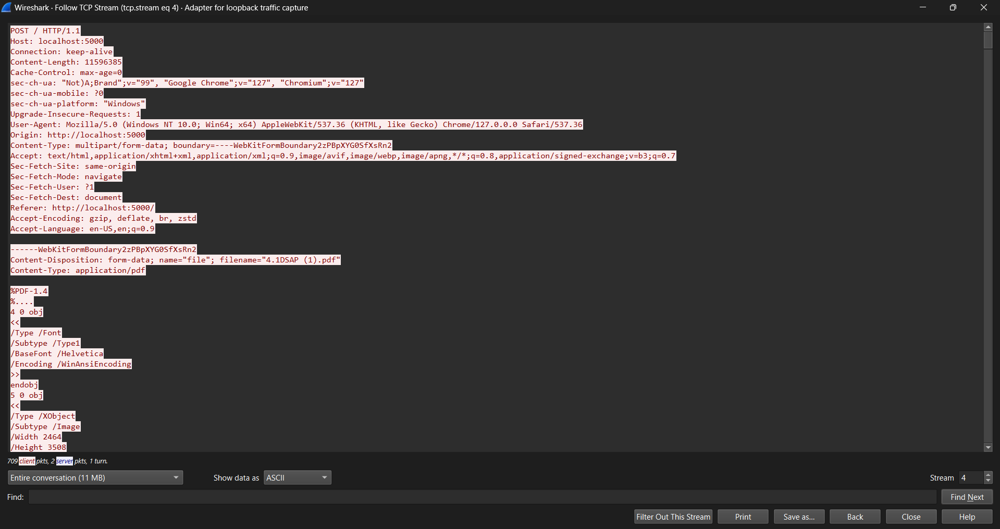

# Capturing the packet of File Upload in Wireshark

Here is the detailed report on uploading the file and capturing the packet in Wireshark

## Requirements
 
-Wireshark is installed

-UploadFile App is running

## Steps followed 

### 1. Wireshark setup

  -Opened Wireshark

  -Selected Adapter for loopback traffic capture interface

  

### 2. Applied http in display filter bar

   -In the filter bar I typed 'http' and entered

   -

   -

### 3. Upload a file in the App

   -

   -

### 4. Locate the post request in the wireshark

   -Here are 2 post request and I selected 1 POST resuest (PDF) 
   
   -
 
### 5. -

   --
   here in this image,on the very bottom center we can see the frame,resemmbled tcp bytes size
   
   --

   ** -Here we can see the total file size is 11596385 bytes ** 
 
### 6.Followed tcp stream by right clicking and selecting tcp stream

  --
  After analyzing it,we came to know the total size of entire conversation between uploading is 11mb ,709 clients packets and 2 server packet and the whole conversation is shown in ASCII

This is the overview of capturing the file upload in wireshark

